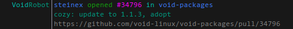
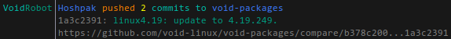
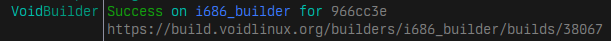
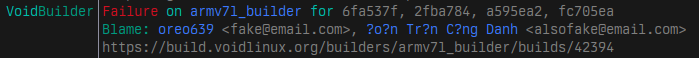
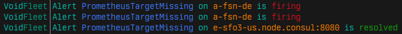

# A hexchat plugin for voidlinux's #xbps channel

## Features

- Reformats messages from void-robot, void-builder, and void-fleet to be easier to read
- [Planned] Ability to generate URLs and title previews for issue mentions in the channel

  
  
  
  
  

## Requirements

- Hexchat 2.16.x (2.14.x might be fine but I did not test)
- The python plugin **compiled with python3.10+**. `hexchat-python3` from the void repos will work.

## Installation

Just place the plugin file in `~/.config/hexchat/addons/`.

## Workarounds

### Soju

The bouncer [Soju](https://soju.im) sends notices in the backlog as server notices, not channel notices. To ensure messages in backlog are formatted by this plugin, add `void_repos_sojuhack = 1` to `$XDG_CONFIG_HOME/hexchat/addon_python.conf` and reload the Python plugin or restart Hexchat.

## Licence

Copyright (C) 2022-2023 0x5c  
Released under the MIT Licence
